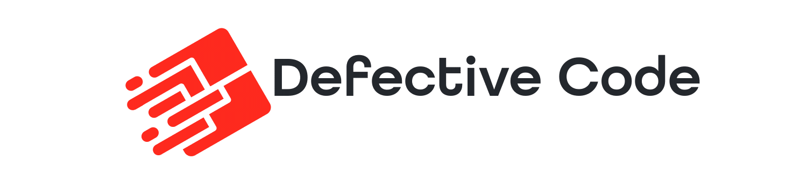

    
    
    

# Introduction

...

# Documentation

You may read the [documentation on our website](https://www.defectivecode.com/packages/skelton).

# Support Guidelines

Thanks for choosing our open source package! Please take a moment to check out these support guidelines. They'll help you get the most out of our project.

## Community Driven Support

Our open-source project is fueled by our awesome community. If you have questions or need assistance, StackOverflow and other online resources are your best bets.

## Bugs, and Feature Prioritization

The reality of managing an open-source project means we can't address every reported bug or feature request immediately. We prioritize issues in the following order:

### 1. Bugs Affecting Our Paid Products

Bugs that impact our paid products will always be our top priority. In some cases, we may only address bugs that affect us directly.

### 2. Community Pull Requests

If you've identified a bug and have a solution, please submit a pull request. After issues affecting our products, we give the next highest priority to these community-driven fixes. Once reviewed and approved, we'll merge your solution and credit your contribution.

### 3. Financial Support

For issues outside the mentioned categories, you can opt to fund their resolution. Each open issue is linked to an order form where you can contribute financially. We prioritize these issues based on the funding amount provided.

### Community Contributions

Open source thrives when its community is active. Even if you're not fixing bugs, consider contributing through code improvements, documentation updates, tutorials, or by assisting others in community channels. We highly encourage everyone, as a community, to help support open-source work.

_To reiterate, DefectiveCode will prioritize bugs based on how they impact our paid products, community pull requests, and the financial support received for issues._

# License

The MIT License (MIT). Please see [License File](LICENSE.md) for more information.
